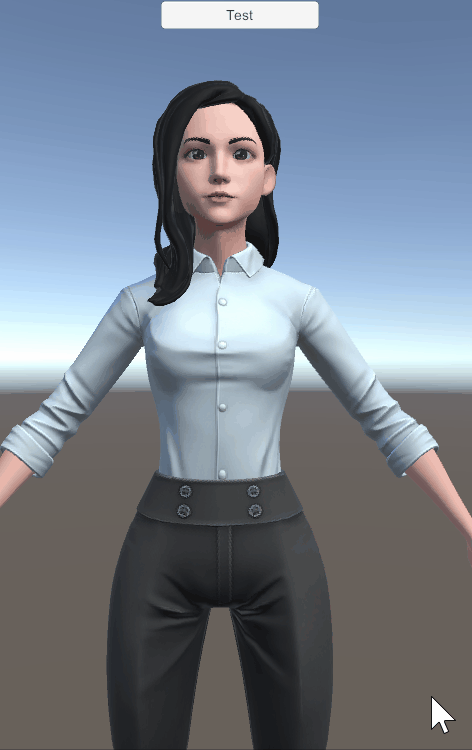

# ARKit Face Blendshape 录制
本项目在[React with Ready Player Me Avatars](https://github.com/srcnalt/rpm-face-tracking)基础上修改。

ARKit Face Blendshapes 是苹果公司的增强现实开发工具包（ARKit）中的一个功能，用于识别和跟踪人脸表情。Blendshapes 是一组预定义的面部动画形状，可以通过检测面部特征点的变化来实现面部表情的跟踪和重建。

本项目通过`mediapipe`人脸动作捕捉输出ARKit Face Blendshapes参数，并驱动Ready Player Me的角色模型进行实时效果展示，并可以录制和下载相应时间段内的Blendshapes参数,可以在Unity 等软件中制作数字人表情动画使用。点击在线[体验](https://arkit-1303089103.cos-website.ap-guangzhou.myqcloud.com/)


### 上手指南
通过react + typescript开发，下载后安装相应依赖包后即可使用。

###### 配置要求

1. nodejs 最新版本

###### 安装步骤
```sh
git clone https://github.com/hillday/arkit-blendshapes-generator.git

# 安装依赖
npm install
# 启动
npm start
```

### 文件目录说明

```
ses-kafka-producer 
├── README.md
├── /public/
├── /src/ # 源程序代码
```

### 录制结果说明
录制结果以json格式存储，格式如下：
```json
{
	"startTime": "1690536009462",
	"endTime": "1690536021894",
	"blendshapes": {
		"browDownLeft": [
			0.1,
			0.2,
			0.3,
			0.2,
			0.7,
			0.9,
			1.0,
			0.1,
			0.1
		]
	},
	"rotations": [
		{
			"x": 0.006122282194266239,
			"y": 0.13906637004510148,
			"z": -0.18647043867114169,
			"order": "XYZ"
		},
		{
			"x": 0.004249464850144405,
			"y": 0.1383254022273489,
			"z": -0.18878034492048632,
			"order": "XYZ"
		}
	]
}
```
`startTime` 为开始录制时间, `endTime`为结束时间,`blendshapes`为blendshape这段时间的值，key为blendshape的名称。`rotations` 为这段时间头部整体的Euler旋转值，选择顺序为XYZ。Unity中使用的效果如下(未做旋转)：



### 版本控制

该项目使用Git进行版本管理。您可以在repository参看当前可用版本。

### 参考
[Ready Player Me](https://readyplayer.me/)

[ARKit Face Blendshapes](https://arkit-face-blendshapes.com/)

[mediapipe](https://github.com/google/mediapipe)

### 作者

qchunhai